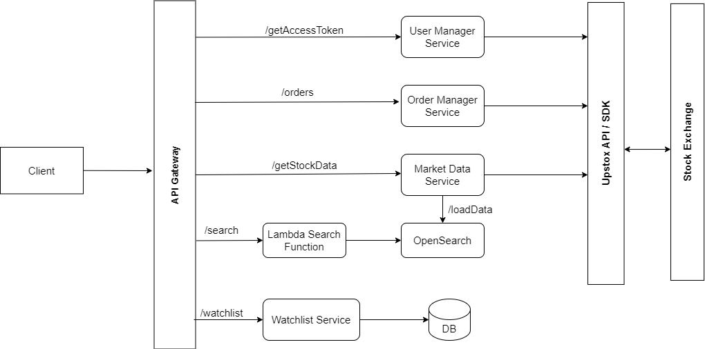

# Stock Broker App

### Designed and Implemented a Stock Broker Application where Users trade and place order with Stock Exchange real-time.

### Tech Stack Used

```
Next JS, Node JS, GraphQL, Socket IO, MongoDB, OpenSearch, AWS, Upstox SDK
```

## Architecture


### Functional Requirements
- Authentication: Login with Upstox and Logout
- Watchlist: Add and Remove Stocks
- Search: Search Stocks and View Stock Details (Charts, Price, OHLC and market Data realtime)
- Place Orders: Buy and Sell Stocks
- Risk management Service

### Non Functional Requirements
- Availability
- Low latency

### Microservices
- User Manager Service
- Order Manager Service
- Market Data Service
- Search Service
- Watchlist Service


### Demo
